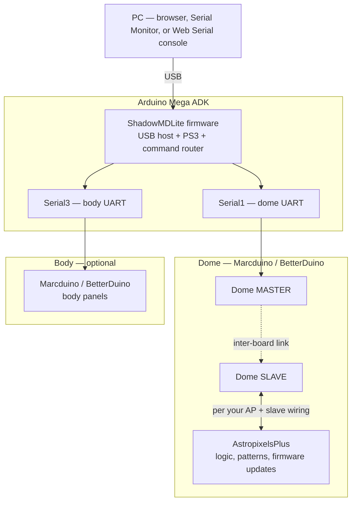

# ShadowMDLite for BetterDuino + AstropixelsPlus

`ShadowMDLite` is a cleaned‑up, modernized version of the classic **Shadow MD** sketch for Arduino Mega ADK, designed to be easier to maintain and to work smoothly with **BetterDuino** firmware and **AstropixelsPlus** logic effects.

This document explains what changed, why, and how to adapt the configuration.

### What it is — and what it is not

**What it is:** a **Marcduino / BetterDuino–centric** Shadow MD sketch: standard **MD function codes (1–89)** only, **BetterDuino-style** serial commands, optional **PC → Serial1 / Serial3** forwarding (`S1:`, `S3:`, `MD:`), and documentation aimed at builders who want **less code** and **clearer** button mapping.

**What it is not:** a drop‑in for every legacy **Shadow MD** setup. All **`type = 2` custom** button paths and their configuration variables were **removed**—if you depended on non‑standard per‑button behaviour outside the Marcduino dispatcher, that configuration is **gone** here by design. This flavour is **not** trying to be universal; it trades that flexibility for **maintainability** and a single, obvious way to map PS3 Nav buttons to **MD codes**.

---

## 1. Goals

- Keep **exactly the same behavior** as the original Shadow MD config (same button actions).
- Remove old, unused and confusing configuration paths.
- Make the **MarcDuino button mapping** much easier to read and edit.
- Use a clean base for systems running **BetterDuino** + **AstropixelsPlus**.
- **Significantly reduce code size**: from about **6 353** lines in `Shadow_MD_DualController_Template.ino` down to about **2 876** lines in `ShadowMDLite.ino` (on the order of **55 % fewer** lines), making the sketch easier to navigate and maintain.

---

## 2. High‑level changes

### 2.1 New ShadowMDLite flavor

- The sketch is now treated as **ShadowMDLite**:
  - Header updated with a short changelog and attribution.
  - Intended as a “clean config” for MarcDuino/BetterDuino users.

### 2.2 Removed custom (type=2) button logic

- All `type = 2` custom functions and their configs were removed:
  - No more `*_cust_MP3_num`, `*_cust_LD_type`, `*_cust_panel`, `*_use_DP*`, etc.
- Every button now uses **only** a standard MarcDuino code via a single variable:
  - `btnXXX_MD_func` for foot controller.
  - `FTbtnXXX_MD_func` for dome controller.
- This removes a large amount of dead / unused code without changing runtime behavior.

### 2.3 Unified button configuration blocks

All button configuration blocks share the same pattern:

```cpp
//---------------------------------
// CONFIGURE: Arrow Right + PS
//---------------------------------
int btnRight_PS_MD_func = 88; // 88 = Eebel Play Next Song
```

This applies to:

- Foot controller:
  - `Arrow Up/Down/Left/Right`
  - `Arrow + CROSS/CIRCLE/L1/PS`
- Dome (FT) controller:
  - `Arrow Up/Down/Left/Right` and their combos.

The MD code and its meaning are always documented inline.

### 2.4 MarcDuino code documentation in one place

- The master table of codes (1–89) is kept **once** near the top of the file:

```cpp
// Std MarcDuino Function Codes:
//     1 = Close All Panels
//     2 = Scream - all panels open
//     3 = Wave, One Panel at a time
//     ...
//    88 = Eebel Play Next Song
//    89 = Eebel Play Previous Song
```

- The **MarcDuino dispatcher** (`switch (MD_func)`) is now fully documented:
  - Each case has a comment with code and description:

```cpp
// 23 = Holo Lights On (All)
case 23:
  // Toggle Holo lights On/Off
  if (HoloOn == false) {
    Serial1.print("*HPF0013\r");
    HoloOn = true;
  } else {
    Serial1.print("*HPF0000\r");
    HoloOn = false;
  }
  break;
```

This makes it trivial to:

- Map from MD code to what the function **should** be (from the top table).
- See what it **actually** does in the `switch`.

### 2.5 Cleaned comments and dead serial commands

- Removed outdated/redundant comments, for example:
  - Old `//Serial1.print("*ON00\r");` that no longer reflect current behavior.
  - Duplicated descriptions that already exist in the main code table.
- Where useful, comments were moved inline and normalized to match the official descriptions.

### 2.6 Debug flags and `#define`s simplified

- **Kept**:
  - `SHADOW_DEBUG` – enables debug prints.
  - `SHADOW_VERBOSE` – enables verbose logging.
- **Removed** (unused in this sketch):
  - `MRBADDELEY`
  - `BETTERDUINO`
- BetterDuino support is now implicit via the **command set** used (e.g. `*HPF`, `*HPR`, `@0T1`, `@0T3`, `*RD00`, etc.), not via macros.

### 2.7 Internal helper types normalized

Internal structs and helper types are centralized and consistent:

```cpp
struct ButtonConfig {
  int type;   // always 1 in ShadowMDLite (Std MarcDuino function)
  int mdFunc; // MarcDuino function code (1–89)
};

static void initButtonConfig(ButtonConfig& cfg, int type, int mdFunc) {
  cfg.type = type;
  cfg.mdFunc = mdFunc;
}

typedef bool (*ActionCheckFn)();

struct MarcDuinoAction {
  ActionCheckFn check;
  const ButtonConfig* cfg;
  const __FlashStringHelper* verbose;
};
```

These types are used to map controller button state to an MD code and optionally log a verbose string when a mapping fires.

### 2.8 Cross-controller L3 and CheatSheet

- **L3 cross-controller**: Eight combos use L3 on the *other* controller (Foot arrow + Dome L3, Dome arrow + Foot L3) so you never press L3 and a d-pad on the same hand. They use the same CONFIGURE comment pattern as other buttons; default `0 = FREE` (no command sent; optional verbose log).
- **CheatSheet**: `CheatSheet.html` and `CheatSheet.md` list the full current button map including these eight FREE (0) L3 combos (IDs 53–60).
- **L2 on Dome (more FREE slots)**: Additional FREE combos were added using **L2 on the Dome controller** as a modifier:
  - `Dome (arrow) + L2` (IDs 61–64)
  - `Dome (arrow) + L2 + Foot (CROSS/CIRCLE)` (IDs 65–72)
  - All default to `0 = FREE` so you can assign MarcDuino codes later.

---

## 3. BetterDuino & AstropixelsPlus integration

### 3.1 BetterDuino commands

The dispatcher uses **BetterDuino‑compatible commands**, such as:

- Holo and logic control:
  - `*HPFxxxx`, `*HPRxxxx`
  - `@0T1`, `@0T3` (logic sets for normal/alarm)
- Random / holo actions:
  - `*RD00`, `*ST00`, etc.
- Volume and magic panel:
  - `$+`, `$-`, `$f`, `$m`
  - `*MO99`, `*MO00`, `*MF10`

These match the BetterDuino extended firmware, so ShadowMDLite is ready for that environment.

### 3.2 AstropixelsPlus behavior

For modes like **Star Wars Disco** / **Star Trek Disco**, the code is arranged to:

- Set a special lighting mode with `@0T3` (alarm or “disco” mode).
- Wait a few seconds.
- Restore the normal pattern with `@0T1`.

This plays nicely with **AstropixelsPlus** patterns (or similar systems), since logic states are toggled in a clean, reversible way.

### 3.3 Topology: PC → Mega (ShadowMDLite) → Marcduino → AstropixelsPlus

The Mega is not only the **USB host** for PS3 Nav controllers: with **`ENABLE_PC_TO_MARCDUINO_FORWARDING`**, the same **USB serial** link from a **PC** can inject lines that ShadowMDLite **parses and forwards** to **`Serial1` / `Serial3`**—the same UARTs used for dome and body **Marcduino / BetterDuino** traffic. So you are not “talking to Shadow” as a dead end; Shadow **relays** BetterDuino text commands (`*…`, `#…`, `@0T1`, `@0T3`, `:MV…`, etc.) to the boards.

**AstropixelsPlus** units are typically wired to the **Marcduino / BetterDuino Dome Slave** (per your club / BetterDuino documentation). Logic and pattern commands that the slave (or master→slave path) understands therefore reach **AstropixelsPlus** through that dome stack. **Firmware updates** for AstropixelsPlus follow the procedure and cabling described for your AP + slave setup; when that workflow uses serial traffic that passes through the dome UART chain, the **PC → USB → Mega → Serial1** path is the same logical pipe you use for live commands—Shadow strips routing prefixes (`S1:` / `S3:`) and forwards the payload.

Typical layout (your labels and UART assignment may differ; this matches the common **Serial1 = dome**, **Serial3 = body** split used in this sketch’s cheat sheet):



---

## 4. Behavior preserved

Despite the cleanup, the runtime behavior is **intentionally preserved**:

- **Same button actions**:
  - Each button (Arrow + modifiers) still triggers the same MD code as your previous working configuration.
  - All Eebel macros/sequences (doors, arms, gripper, interface tool, disco, songs) are still available on the same combinations.

- **Auto‑dome unchanged**:
  - `domeAutomation` and `autoDome()` logic are untouched.
  - Auto‑dome is still toggled via:
    - `L2 + CIRCLE` – ON
    - `L2 + CROSS` – OFF
  - Only the MarcDuino button configuration and documentation were modified, not drive/dome logic.

---

## 5. How to change what a button does

To remap a button to a different MarcDuino function:

1. **Find the button’s MD config**  
   Example (foot, Arrow Right + PS):

   ```cpp
   //---------------------------------
   // CONFIGURE: Arrow Right + PS
   //---------------------------------
   int btnRight_PS_MD_func = 88; // 88 = Eebel Play Next Song
   ```

2. **Choose a new MD code** from the top table (`1–89`), e.g.:

   ```text
   30 = Open All Dome Panels
   ```

3. **Update the value and comment**:

   ```cpp
   int btnRight_PS_MD_func = 30; // 30 = Open All Dome Panels
   ```

4. Upload the sketch. The `MarcDuinoAction` mapping and `marcDuinoButtonPush()` will automatically route the new MD code through the existing switch logic.

---

## 6. Requirements

### 6.1 Hardware

- Arduino Mega ADK rev3.
- **PS3 Move Navigation** controller(s) (the small one-handed Move accessory, *not* standard PS3/DualShock controllers).
  - Buttons available: D‑pad (UP, DOWN, LEFT, RIGHT), **L1**, **L2**, **L3** (stick click), **CROSS**, **CIRCLE**, **PS**. Face buttons are **only CROSS and CIRCLE**. No SELECT, TRIANGLE, SQUARE, START, or R1/R2/R3.
  - **Cross‑controller L3**: To avoid pressing L3 and a d‑pad direction on the same controller, L3 is used on the *other* controller: **Foot arrow + Dome L3** and **Dome arrow + Foot L3**. The 8 combos (`footBtn*L3_MD_func`, `domeBtn*L3_MD_func`) default to `0` (FREE); set to a MarcDuino code (1–89) to assign an action.
- Sabertooth foot drive and SyRen 10 (or compatible) for dome.
- MarcDuino / BetterDuino controller(s) for:
  - Dome panels.
  - Optional body panels.
- AstropixelsPlus or equivalent logic/lighting driver (recommended).

### 6.2 Arduino libraries

- **USB Host Shield**  
  (Kristian Lauszus / TKJ Electronics – used for PS3BT).
- **Sabertooth**  
  (for dual motor driver control).
- Standard AVR / Arduino core for Mega.

---

## 7. Quick checklist when upgrading

- [ ] Flash **BetterDuino** firmware to the MarcDuino‑compatible boards.
- [ ] Ensure **AstropixelsPlus** patterns are configured to react to:
  - `@0T1` (normal)
  - `@0T3` (alarm/disco)
- [ ] Verify PS3 Nav controllers connect and are recognized by the USB Host Shield.
- [ ] Confirm that:
  - Foot controller buttons call the expected MD codes.
  - Dome controller buttons (FT) call the expected MD codes.
- [ ] Test **auto‑dome**:
  - `L2 + CIRCLE` → Dome starts random motion.
  - `L2 + CROSS` → Dome automation stops and returns home.

---

## 8. Summary

`ShadowMDLite` is a **clean, documented** evolution of the classic Shadow MD sketch, specifically tuned for:

- **BetterDuino** extended command set.
- **AstropixelsPlus** logic and lighting.
- Easy maintenance and configuration of button → MarcDuino mappings.

All the original “magic” (Eebel macro sequences, dome automation, disco modes, door/arm toggles, playlist control) is preserved, but the code is now structured so that changing or understanding any button behavior is straightforward and low‑risk.

---

## 9. PC control over USB (`Serial`)

To send actions from a **PC** to the **Mega ADK** over the **USB serial** port (trigger Marcduino commands without the PS3 Nav), the sketch includes a small **text protocol** on `Serial` (see [`PCSerialProtocol.md`](PCSerialProtocol.md)). That traffic is **forwarded** to the Marcduino UARTs—same path as PS3-driven actions—so commands can reach **Dome / Body BetterDuino** and, via the **Dome Slave**, **AstropixelsPlus** (see **§3.3**).

---

## 10. Web Serial console (browser)

A **local HTML tool** in [`serial-web-console/`](serial-web-console/) uses the **Web Serial API** (Chrome / Edge) to connect to the Mega, send the same style of lines as the Arduino Serial Monitor, and offers an **R2‑D2 blueprint** UI for panel/holo calibration. Full details, limitations, and “what it is / what it is not” are in [`serial-web-console/README.md`](serial-web-console/README.md).


