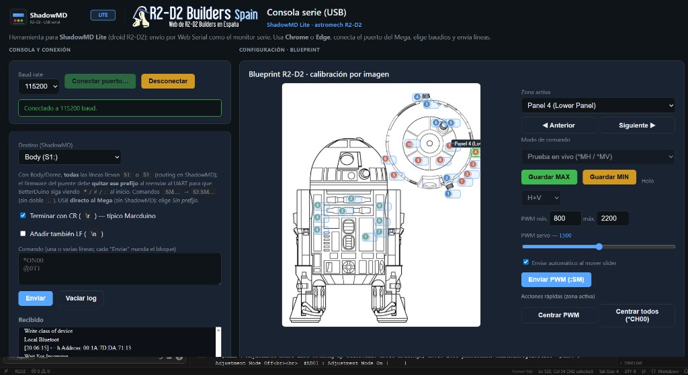

# ShadowMD Lite — Web Serial console (Mega / Marcduino)

## What this is — and what it is not

**What it is**

- A **local web page** (no server required) that talks to your **Arduino Mega ADK** over **USB** using the **Web Serial API** (Chrome / Edge).
- Built for workflows where **ShadowMD Lite** on the Mega forwards **Marcduino / BetterDuino** text commands (`*`, `#`, `@`, `:MV…`, etc.) to **Serial1 / Serial3**, optionally with **`S1:` / `S3:`** routing prefixes that the firmware strips before the UART.
- Adds a **visual R2-D2 blueprint** for **panel and holo calibration**: sliders, live `*MH` / `*MV`, EEPROM save helpers (`#SO` / `#SC`, `#HO` / `#HC`, …), and quick open/close/center actions aligned with **BetterDuino**-style syntax.

**What it is not**

- **Not a generic serial terminal** for every droid stack. If you rely on **custom non–Marcduino** command paths, **ShadowMD-specific** routing, or button `type=2`–style behaviour from the full **Shadow MD** template, this repo and firmware flavour intentionally **do not** preserve that complexity—you standardise on **Marcduino function codes** and the **BetterDuino-oriented** command set.
- **Not a replacement** for reading your own wiring and firmware: wrong **baud**, wrong **S1/S3** choice, or a Mega that is **not** running compatible forwarding will not “just work.”
- **Trade-off**: you give up the **flexibility** of the old multi-path configuration; you gain **clarity**, a **smaller sketch**, and tooling (this page + [`PCSerialProtocol.md`](../PCSerialProtocol.md)) that matches **Marcduino/BetterDuino + ShadowMD Lite**.

**Interface language**: open `index.html` and use the **language** control in the header to switch **English** and **Spanish** (stored in `localStorage`).

---

## Assets in this folder

| File | Purpose |
|------|---------|
| `shadowmd-lite.svg` | **ShadowMD Lite** logo |
| `logo.png` | Astromech branding ([source](https://www.astromech.com.es/assets/images/logo.png)) |
| `2026-03-20-20-06-23.png` | Screenshot of the two-column UI (console + blueprint) |
| `i18n.js` | English / Spanish strings for the UI (`index.html` loads this file) |
| `r2d2plans.png` | Blueprint image (optional local file; falls back to a remote URL if missing) |

---

## Requirements

- **Chrome** or **Edge** (Web Serial API).

## Quick start

Open **`index.html`** in the browser (double-click or drag into Chrome/Edge), or serve the folder with a local static server if you prefer. On wide screens the layout is **two columns**: left — USB serial console; right — blueprint and calibration; on narrow screens they **stack**.

1. Click **Connect port** and choose the Arduino / COM port.
2. Set **baud rate** if it is not 9600 (match your firmware, often **115200** for ShadowMD Lite).
3. Type a command (e.g. `*ON00`) and **Send**.
4. By default a **`\\r`** is appended (typical Marcduino). Enable **LF** if your board expects `\\n` as well.

---

## User guide (blueprint)

### 1) Selecting a zone

- Use the **Active zone** dropdown, **Previous / Next**, or click **hotspots** on the image.
- When you change zone, the serial **destination** is updated for typical ShadowMD wiring:
  - **Body (green markers)** → `S3:`
  - **Dome / holos (red / blue)** → `S1:`
- You can force **`S2:`** from the dropdown if your Mega routes the second UART that way.

### 2) Zone types

- **Body + dome servos** (`b*` green, `s*` red): same **Marcduino** commands; only the **serial prefix** changes (`S3:` vs `S1:`).
  - Slider / live send: **`:MVxxdddd`** (`xx` = `mdPanel` in `R2_BLUEPRINT_ZONES` in `index.html`, `dddd` per BetterDuino).
  - **Open / Close**: **`:OPxx`** / **`:CLxx`**.
  - EEPROM **Save MAX / MIN**: **`#SOxxdddd`** / **`#SCxxdddd`**.
  - See **BetterDuino** docs for `:OP`, `:CL`, `:MV`, `#SO`, `#SC`.

- **Holos** (`kind: "holo"`, IDs `01`–`03`; BetterDuino **slave**):
  - **H** and **V** sliders; live commands **`*MHxxdddd`** and **`*MVxxdddd`**.
  - EEPROM only via **Save MAX / MIN** (not mixed with casual slider moves):
    - MAX → `#HO` / `#VO`; MIN → `#HC` / `#VC` (depending on **H+V / H / V** selector).
  - **Center holo**: `*CHxx`; **Center all holos**: `*CH00`.

### 3) Quick actions

- **Open panel / Close panel** (servo zones): **`:OPxx`** / **`:CLxx`** with the ShadowMD prefix (e.g. dome **`S1::OP10`**, body **`S3::OP01`** — note **`::`** when the payload starts with `:`).
- **Center**: panels → slider mid + `:MV`; holo → `*CHxx` + sliders mid.
- **PWM range** default **800–2200**; editable in **min / max** fields.

### 4) Image map

Marker colours: red = dome master, blue = dome slave / holos, green = body. Geometry lives in **`R2_BLUEPRINT_ZONES`** (`map` or `maps` per zone).

---

## Notes

- Only **one app** can hold the COM port — close Arduino Serial Monitor and similar tools.
- Received data from the Mega appears under **Received**.
- With **`S1:` / `S2:` / `S3:`**, the prefix is for **ShadowMD routing** on the Mega; firmware should **strip** it before the Marcduino UART. Lines starting with **`:`** use **`::`** after the prefix (e.g. `S1::MV011500`).
- If USB goes **straight to the Mega** with no routing prefix, choose **No prefix (direct to Mega)**.

---

## Screenshot

Two-column layout: **Web Serial** connection, command line, receive log, and **blueprint-based** calibration (zones, PWM, holo tools).
